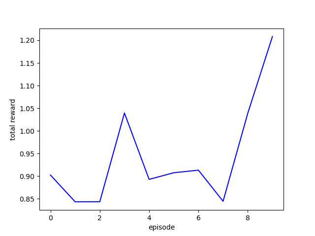

# Matlab2PyTorchRL

This project is a pipeline that connects a Matlab simulation (Simulink) to an OpenAI Gym wrapper for PyTorch Reinforcement Learning using the DQN algorithm.

## Matlab implementation

Matlab simulations offer an excellent way to model real-world scenarios. This project aims to establish a connection between Matlab simulations and third-party libraries and open-source AI solutions. As such, we have chosen to develop an interface that bridges a Matlab simulation with Python AI libraries

The simulation that we used to test the interface is based on a Robot (Thymio) navigating through a maze, the robot has multiple sensors to measure the distance to nearby walls with the goal of learning how to efficiently navigate throught the maze and exit it safely.

### Prerequisites

What things you need to install the software and how to install them:

- Matlab
- Simulink
- OpenAI Gym
- PyTorch

### Installing

1. Clone the repo
2. Navigate to the project directory
3. Install requirements.txt `pip install -r requirements.txt`
4. [Install Matlab engine for Python](https://fr.mathworks.com/help/matlab/matlab_external/get-started-with-matlab-engine-for-python.html)
4. Run the main.py script

## Running the tests

## Built With

* [Matlab](https://www.mathworks.com/products/matlab.html)  based on the amazing implementation of [The Pledge Algorithm - Thymio Robot Model on a Maze](https://fr.mathworks.com/matlabcentral/fileexchange/67399-the-pledge-algorithm-thymio-robot-model-on-a-maze)
* [OpenAI Gym](https://github.com/openai/gym) - The reinforcement learning wrapper
* [TorchRL and DQN](https://github.com/pytorch/rl) - The deep learning library used, various algorithms can be implemented easily other than DQN that we used

## Authors

*Initial work* - [Spinkoo](https://github.com/Spinkoo)

## License

see the [LICENSE.md](LICENSE.md) file for details

## Acknowledgments

* Hat tip to anyone whose code was used
