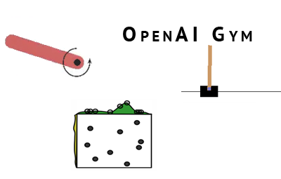

## Matlab engine and simulation
## Overview

**This folder contains the Python controller for interfacing with Matlab simulations. It is designed to provide a seamless integration between Python and Matlab, enabling complex simulations to be controlled and manipulated programmatically at <ins>Runtime</ins>.**

## Matlab engine ([`mat_engine.py`](./Matlab2Py/mat_engine.py))
`mat_engine.py` is a Python controller. It acts as a bridge between the Python environment and the Matlab simulation, allowing for the execution of Matlab scripts and the retrieval of simulation data directly from Python.

## Maze Environment ([`maze_env.py`](maze_env.py))

`maze_env.py` is a custom Gym environment wrapper for the Matlab simulation. It provides an interface for reinforcement learning algorithms to interact with the simulation, enabling the training of agents to navigate through a maze.

### Key Features

- **Gym Environment Compatibility**: The environment is designed to be compatible with the OpenAI Gym framework, allowing for easy integration with reinforcement learning libraries and tools.
- **Customizable Simulation Parameters**: The environment supports customization of simulation parameters such as the display block, render mode, step size, and observation dimension, providing flexibility in setting up different simulation scenarios.
- **Action and Observation Spaces**: It defines a discrete action space for agent movement (left, right, forward) and a dictionary observation space for the agent's and target's locations, facilitating the agent's learning process.
- **Reward Calculation**: The environment includes a reward calculation mechanism that encourages the agent to navigate efficiently through the maze, taking into account obstacle avoidance and time efficiency.
- **Simulation Loop**: The simulation loop within the environment handles the execution of actions, updates the simulation state, and calculates rewards, providing a realistic and dynamic environment for training.
