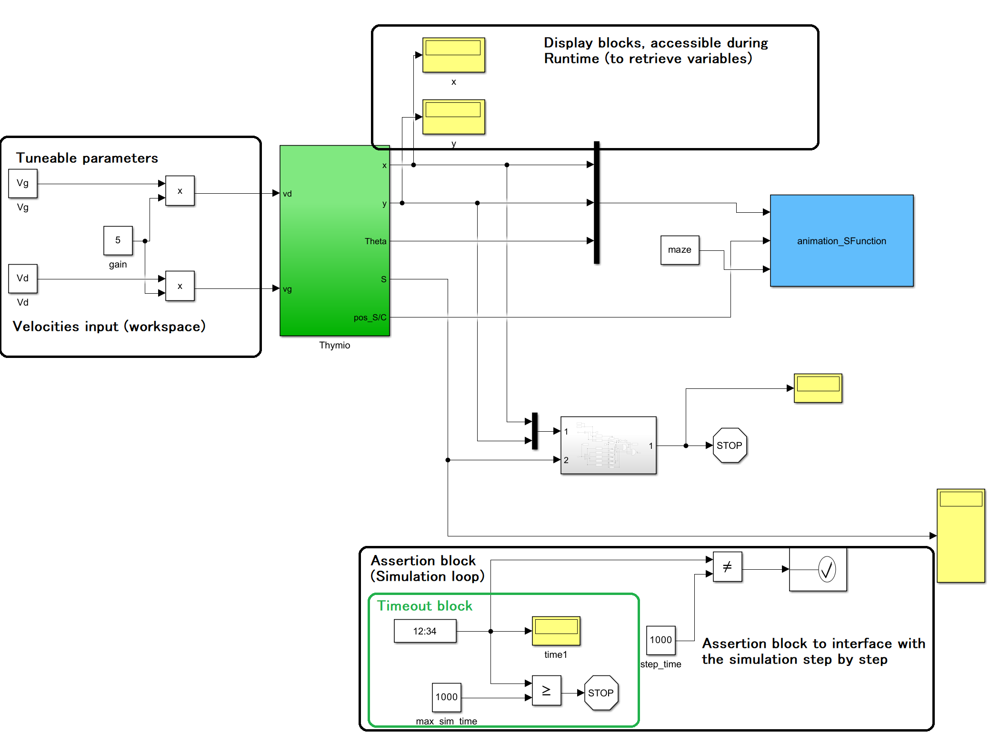

  <strong>A Thymio in a maze</strong>

This is the Readme for a simulation of a Thymio runing through and solving mazes, implemented in Matlab's Simulink.

 -------------------------------------
    ----|    Prerequisites    |----   
 -------------------------------------

   Matlab and Simulink > 2015a

 -------------------------------------
    ----|    Running tests    |----   
 -------------------------------------

   1 - Run setup.m

   2 - Run Simulation_2_Wall_Follower_v1.slx

 --------------------------------------
    ----|     Simulink model     |----   
 --------------------------------------

 

The input block is set in the workspace for a smooth and simple modification from the Python engine

The assertion block is necessary to properly run step by step the simulation assuring a fixed step size when interfacing with the engine
 --------------------------------------
    ----|     Files     |----   
 --------------------------------------

   [Load end initialize all parametres we need for a simulation.](./setup.m) 

   [Contients the main caracteristiques of the robot.](constante.m)

   [Scales the pixels values of a picture.](thresholding_image.m)

   [Creat a figure where the Thymio can move.](animation.m)

   [Take and give all parametres from the simulink simulation to the animation.](animation_SFunction.m)

   [Simulate the a Thymio solving a maze following a wall. ](Simulation_2_Wall_Follower_v1.m)

   [Maps of the maze.](./maze)

 
 ----------------------------------
    ----|    References    |----   
 ----------------------------------

 (1) Robotics, Vision and Control - Fundamental algorithms in Matla Peter Corke

 (2) Using MATLAB Graphics from Simulink, Mike Garrity
     https://blogs.mathworks.com/graphics/2014/10/21/double_pendulum/

 (3) simple_2D_steering_animation_v2, Marc Compere, comperem@gmail.com
     https://fr.mathworks.com/matlabcentral/fileexchange/54852-simple-2d-kinematic-vehicle-steering-model-and-animation

 -------------------------------
    ----|    Abouts    |----   
 -------------------------------

Made by students of Aix-Marseille University

BAMOUDOU Nassouif - issa.nassouif@gmail.com

ATIAS Sophian - triedge558@gmail.com

CHARPENTIER Jonathan - j.the-foam@hotmail.com

Modified by Wail HARROUZ

created  : 06 Feb 2018

modified : 10 Oct 2023

 -----------------------------\----------------------------/-----------------------------